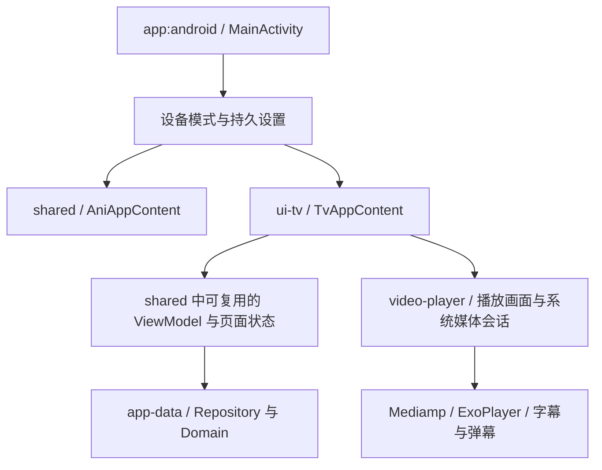

# Animeko Android TV 适配技术方案

日期：2026-09-19。源码基线：`0f06348e4`。交付状态：技术设计；功能、安装包及电视实机验证属于实施阶段。

## 1. 目标与设备边界

目标是让用户仅使用电视遥控器，完成「安装 → 启动 → 配置/登录 → 找番 → 选集 → 选资源 → 播放 → 续看」的完整流程。

首期采用同一个 Android 应用、同一套业务和存储，提供电视专用界面。手机、平板继续使用各自的界面。

| 项目 | 首期约束 |
| --- | --- |
| 系统 | Android 8.1 / API 27 及以上，沿用仓库的 `android.min.sdk=27` |
| 设备 | Android TV、Google TV，以及允许安装 APK 的 Android 电视/盒子；具体型号尚未提供 |
| 输入 | 上、下、左、右、确认、返回；媒体键可选，不依赖菜单键、触摸、鼠标或语音 |
| 架构 | ARM64 为首个交付目标；ARM32 作为独立验收目标；模拟器使用其系统镜像对应的 ABI |
| 显示 | 横屏，720p/1080p 基础可用，4K 屏幕验证排版与性能 |
| 分发 | 首期侧载 APK；商店发布、推荐频道和系统全局搜索独立排期 |
| 登录 | 邮箱验证码提供可操作的基础路径；Bangumi 手机扫码授权通过跨设备验证后启用 |

Android 8.0 是 API 26，低于当前仓库要求。若目标电视只有 8.0 或更低版本，需另做依赖、API 和原生库兼容评估，不能通过修改 Manifest 宣称支持。ARM64 芯片也不能直接证明系统支持 ARM64 APK，最终以系统上报的 ABI 列表为准。

不具备 APK 安装能力的系统不在这套 Android 方案覆盖范围内。

## 2. 源码现状与适配缺口

以下结论来自当前源码静态检查，未代表目标电视运行结果。

| 位置 | 现状 | 设计含义 |
| --- | --- | --- |
| [AndroidManifest.xml](../../../app/android/src/main/AndroidManifest.xml) | 只有普通 `LAUNCHER`；未声明电视入口、banner 和触屏可选 | 需要补齐电视安装与启动声明 |
| [Android 构建配置](../../../app/android/build.gradle.kts) | 默认 ARM64；可配置 ARM32、x86_64，支持 ABI 分包与 universal APK | 可复用打包机制，但必须核对各 ABI 的原生依赖 |
| [gradle.properties](../../../gradle.properties) | minSdk 27，compile/target 使用 SDK 37 | 系统下限与电视输入适配是两项独立工作 |
| [MainActivity.kt](../../../app/android/src/main/kotlin/activity/MainActivity.kt) | 创建 `AniApp` 和 `AniAppContent`，统一处理条目深链 | 是设备分流和入口恢复的改动点 |
| [AniAppContent.kt](../../../app/shared/src/commonMain/kotlin/ui/main/AniAppContent.kt) | Navigation 3 路由、页面级 ViewModel、登录和全局覆盖层 | 复用导航机制，为电视提供独立路由渲染 |
| [AniApp.kt](../../../app/shared/src/commonMain/kotlin/ui/main/AniApp.kt) | 应用主题、图片加载、全局验证码覆盖层等初始化 | 根容器也需要区分电视交互，不能只替换首页 |
| [ActiveInputSource.kt](../../../app/shared/ui-foundation/src/commonMain/kotlin/ui/foundation/input/ActiveInputSource.kt) | 跟踪触摸和鼠标指针 | 不能用指针类型或屏幕宽度判断电视模式 |
| [PlayerKeyboardShortcuts.kt](../../../app/shared/video-player/src/commonMain/kotlin/ui/gesture/PlayerKeyboardShortcuts.kt) | 左右跳转，上下调音量，Enter 被消费；保留部分 D-pad 中键点击行为 | 已有局部按键能力，但与电视菜单导航语义不同 |
| [EpisodeViewModel.kt](../../../app/shared/src/commonMain/kotlin/ui/subject/episode/EpisodeViewModel.kt) | 集成查询、选择、播放、进度保存、自动下一集、弹幕等 | 复用播放会话，电视只组织呈现与输入 |
| [VideoPlayer.android.kt](../../../app/shared/video-player/src/androidMain/kotlin/ui/VideoPlayer.android.kt) | Mediamp/ExoPlayer Surface，原生控制条关闭，叠加 ASS 字幕 | 保留内核、Surface 和字幕，增加电视控制层 |
| [OAuthConfigurator.kt](../../../app/shared/app-data/src/commonMain/kotlin/domain/session/auth/OAuthConfigurator.kt) | 创建 requestId、返回授权链接、轮询登录结果 | 扫码存在复用基础，但跨设备回调与服务端约束需要验证 |
| [默认订阅](../../../app/shared/app-data/src/commonMain/kotlin/data/repository/media/MediaSourceSubscriptionRepository.kt) | 已有默认资源订阅配置 | 电视需展示初始化状态、失败重试及订阅管理入口 |
| [Android UI 测试实现](../../../utils/ui-testing/src/androidMain/kotlin/AniComposeUiTest.android.kt) | `runAniComposeUiTest` 可运行；三个 `assertScreenshot` 实现均为空 | Android 上通过截图断言不能证明画面正确 |

仓库中未检索到完整的电视设备分流、Compose TV 组件依赖或 MediaSession 接入。应将「已有键盘操作」和「完整电视支持」分别验收。

## 3. 架构选型

| 路线 | 成本与收益 | 适用判断 |
| --- | --- | --- |
| **同一 APK，电视独立 UI，共享业务** | 增加电视页面和焦点体系；账号、数据源、播放能力可复用；保持统一升级链路 | **采用** |
| 在现有手机/桌面页面逐项增加遥控器支持 | 初始入口成本低，但抽屉、输入、长列表、手势和弹窗逐页修补，回归范围大 | 适合少量补充，不作为整体路线 |
| 独立电视应用与包名 | 可独立发布与缩减体积；需要额外维护初始化、账号、升级和版本兼容 | 首期收益不足 |

Android 官方建议复用应用架构并提供电视专用布局，支持一个应用覆盖手机和电视。[官方入口与应用结构指南](https://developer.android.com/training/tv/get-started/create)

### 3.1 模块边界

新增 `:app:shared:ui-tv`，作为只编译 Android 的 UI 库；使用已有 `ani.android-library` 构建约定及 Compose 插件。它由 `:app:android` 直接依赖，不加入 `:app:shared` 聚合模块的依赖列表。



约束：

- `ui-tv → shared` 是单向依赖；`shared` 不导入电视组件，避免循环依赖。
- TV Material 依赖只在 Android 模块；跨平台 `commonMain` 不引用 `androidx.tv.material3`。
- 首期可调用现有公开 ViewModel。只有遇到 UI 强耦合、重复副作用或不合适的可见性时，提取对应的状态/业务接口；不以全量拆分 `EpisodeViewModel` 为前置条件。
- `TvPlaybackPresenter` 负责把既有播放状态映射成电视 UI 状态，不创建第二个播放器或第二条资源查询链路。
- `TvOverlayHost` 管理电视可交互的全局提示。`AniApp` 为覆盖层渲染提供注入点，手机仍使用现有默认实现。

### 3.2 组件与版本策略

电视按钮、卡片、列表项、开关采用 Compose for TV；网格和列表使用常规 Compose Foundation Lazy 布局，显式管理焦点与滚动。官方发布说明已移除旧 TV Lazy 布局，本方案不使用 `TvLazyRow` / `TvLazyColumn`。[Compose TV 发布说明](https://developer.android.com/jetpack/androidx/releases/tv)

依赖候选为 `androidx.tv:tv-material:1.1.0`，以 2026-09-19 官方稳定版本信息为依据。通过仓库版本目录管理，并先验证与当前 Kotlin 2.4.10、Compose Multiplatform 1.11.1、Android Compose 1.11.2 的解析及编译结果；不为了电视适配整体升级工具链。

TV 子树使用独立的 `TvTheme`；共享色值和字体配置通过映射进入电视主题。手机 Material 与 TV Material 拥有各自的主题，不能假设任意控件混用后具有一致行为。[Compose for TV 指南](https://developer.android.com/training/tv/playback/compose)

## 4. 启动、设备识别与导航

### 4.1 Manifest 与入口

- 在同一个 `MainActivity` 上保留普通 `LAUNCHER`，增加 `MAIN + LEANBACK_LAUNCHER` 的入口声明，保持单个 Activity 和深链处理入口。
- 增加 `android.software.leanback required=false` 与 `android.hardware.touchscreen required=false`。
- 增加电视 banner；至少提供 320×180 xhdpi 资源，并匹配支持语言的文字。检查最终合并 Manifest，确认依赖库没有引入不适合电视的必需硬件声明。
- 横屏要求只作用于电视模式，手机保持自己的方向策略；电视模式不依赖状态栏、导航手势或陀螺仪旋转。

这些声明解决系统识别和启动入口；遥控器可用性由后续 UI 工作保证。[Manifest 与 banner 要求](https://developer.android.com/training/tv/get-started/create)

### 4.2 模式选择

引入独立的 `DeviceFormFactor`，与 `Platform.Android` 和窗口宽度分别表达。持久设置为 `Auto / Tv / Standard`，默认 Auto。

Auto 判定依据是 `UiModeManager.currentModeType == UI_MODE_TYPE_TELEVISION`，辅以系统 Leanback 特征和本次电视 launcher 启动来源。插入鼠标不改变电视模式，平板横屏或外接键盘不自动变成电视。

国产系统可能无法上报电视特征：首次启动在「非电视模式、无触屏且存在方向导航能力」的设备上展示可用遥控器选择的模式卡片。设置中始终提供模式切换；开发构建提供强制 TV 的测试入口。该提示支持返回，避免错误识别设备后锁死入口。

模式切换在退出播放后生效并重建 UI 栈，不同时挂载两套根界面。模式设置读取完成后再展示内容，避免先闪现手机界面。

### 4.3 路由与生命周期

`TvAppContent` 使用现有 `AniNavigator`、Navigation 3 back stack 和页面 ViewModel 生命周期约定。为首页、搜索、条目、播放、登录、设置及历史页面提供电视 entry；不把任意路由交给手机页面兜底。

条目深链等待导航栈就绪后进入对应电视页面，冷启动和运行中 `onNewIntent` 均验收。不使用固定延时保证初始化正确。首期范围以外的深链展示可返回的说明页，不能跳入无法遥控的页面。

页面返回优先恢复原有焦点及滚动位置。退出根页面交还系统桌面，不建立无法退出的返回循环。系统返回键、应用返回按钮和键盘 Escape 共用一条返回处理路径。

## 5. 首期页面与焦点规范

### 5.1 页面范围

| 页面 | 必须支持的行为 | 首次焦点 |
| --- | --- | --- |
| 初始化 | 默认订阅同步状态、网络失败重试、进入基础设置 | 继续或重试 |
| 首页 | 继续观看、最近更新/探索、搜索、我的追番、设置 | 有记录时为首张续看卡，否则为首张内容卡；空态为搜索 |
| 搜索 | 输入关键词、提交、加载、空结果、分页、进入详情并返回 | 搜索框；提交后结果首项 |
| 我的追番/历史 | 分组、列表、继续播放；未登录时提供可达的登录入口 | 上次项目或首项 |
| 条目详情 | 简介、收藏状态、续播、分组/分页选集 | 续播按钮或第一集 |
| 资源选择 | 数据源进度、资源列表、过滤、手选、重试 | 当前选中资源；无资源时为重试 |
| 播放 | 暂停、进度、选集、换资源、字幕/音轨、弹幕、退出 | 隐藏控制层的播放焦点目标 |
| 登录 | 邮箱验证码；经验证的 Bangumi 扫码入口；取消/超时/失败 | 主要登录方式 |
| 基础设置 | 模式、账号、订阅启停/更新/地址输入、字幕弹幕、缓存额度与清理、版本信息 | 第一项或上次设置项 |

首期不暴露评论编辑、一起看、复杂下载管理、规则编辑器等尚未适配的入口。它们不属于看番闭环的发布条件；账号同步、基础资源配置和播放恢复属于发布条件。

### 5.2 布局与焦点

- 以约 960×540 dp 的电视画布设计，而不是把 1920×1080 像素当成 dp。主内容保留约 5% 可调整安全边距；播放视频可全屏，控件和字幕保持在安全区。
- 正文以 18sp 起步，标题约 24–32sp；具体密度与三米观看距离实测。重点操作使用文字标签，不只放图标。
- 焦点至少有描边和背景变化，可附加小幅缩放；低性能模式关闭高成本光晕/模糊，仍保持清晰焦点。
- 横向列表、导航区、弹窗分别建立 focus group。跨区域方向使用 `focusProperties`，初次进入使用 `FocusRequester`，返回使用稳定业务 ID 恢复。
- Lazy 项目使用稳定 key；保存列表位置及 `subjectId/episodeId/mediaId` 等焦点身份。恢复时先滚动到目标并等待节点进入布局，再申请焦点。
- 异步加载、排序、刷新不主动把焦点跳到第一项。目标消失时选择同一区域最近有效项，区域为空则落到重试/返回等稳定操作。
- 焦点进入屏幕外项目时自动滚动到可见安全区；边界不随意环绕、不跳进不可见控件。
- 弹窗打开后焦点限制在弹窗内；关闭后恢复触发按钮。加载指示、图片和装饰文字不成为多余焦点。
- 输入框只在确认进入编辑时唤起 IME；返回先关闭键盘，再关闭编辑层，再退出页面。中文搜索使用电视系统输入法；没有输入法的设备显示明确提示，不把语音作为依赖。

Compose 的焦点分组和焦点请求机制可支持上述实现，实际移动顺序仍须编写交互测试。[焦点行为文档](https://developer.android.com/develop/ui/compose/touch-input/focus/change-focus-behavior)

## 6. 播放器与遥控器状态机

### 6.1 复用链路

沿用 `EpisodeViewModel → EpisodeFetchSelectPlayState / EpisodeSession → MediaFetcher / MediaSelector / MediaResolver → MediampPlayer`，以及进度、自动选资源、下一集、弹幕和字幕组件。保留条目级资源查询复用，电视切集不能额外创建独立查询器。

`TvPlayerScreen` 挂载现有视频 Surface 与弹幕/字幕层，使用 `TvPlayerOverlay` 提供控制条及侧面板。播放器由页面级会话持有；组合重绘、显示菜单或打开资源面板都不重建播放器。

### 6.2 按键规则

| 状态 | 确认 / Enter | 左右 | 上下 | 返回 |
| --- | --- | --- | --- | --- |
| 控制层隐藏 | 显示控制条，焦点到播放/暂停按钮；首次确认不改变播放状态 | 进入进度预览，各移动 10 秒 | 显示控制条并聚焦主要操作 | 退出播放并保存进度 |
| 控制条显示 | 执行当前按钮 | 在按钮间移动；进度条获得焦点时进入进度预览 | 在进度条和操作行之间移动 | 隐藏控制条 |
| 进度预览 | 提交一次 seek，返回控制条 | 短按每次 10 秒，长按 0.5 秒后按 30 秒步长重复预览 | 保持预览，避免隐式提交 | 放弃预览并返回进入前状态 |
| 选集/资源/设置面板 | 执行当前项 | 按面板布局移动 | 按面板布局移动 | 关闭面板并恢复触发点 |
| 错误层 | 重试或换资源 | 在恢复操作间移动 | 按布局移动 | 退出播放 |

隐藏状态的确认键、键盘 Enter 和遥控器中键语义一致。电视控制层不挂载现有 PC `playerKeyboardShortcuts`，避免上下键调音量或吞 Enter 干扰焦点。

按键处理要求：

- 点击类操作一次按下/抬起只执行一次；方向导航支持系统连发。进度预览限于 `[0, duration]`，不可 seek 的资源显示禁用说明。
- 预览期间显示目标时间；提交时才调用一次 `MediampPlayer.seekTo`。媒体切换会取消未提交预览。
- 控制条在播放中静置 5 秒后隐藏；暂停、预览、弹窗、错误、输入及读屏交互期间不自动隐藏。隐藏时将焦点交回播放焦点目标。
- 仅消费当前状态处理的按键；输入框、弹窗和原生 View 不同时响应播放器快捷键。
- 音量键、Home 和电源键交给系统。媒体播放/暂停键在控制层隐藏时也有效。
- 核心操作均可通过方向键和确认完成；菜单键和长按都不能成为唯一入口。[电视交互质量要求](https://developer.android.com/docs/quality-guidelines/tv-app-quality)

### 6.3 系统媒体会话

增加与现有 Media3 版本一致的 `media3-session` 依赖，首期固定为仓库的 1.9.0，不直接复制新版文档中的整套依赖。`TvMediaSessionBridge` 位于 `video-player` 的 Android 源集，接收播放器、元数据及剧集操作回调，返回可释放的会话句柄。

采用 Media3 `SimpleBasePlayer` 适配器暴露所需状态和命令，播放/暂停/seek 转回 Mediamp，下一集转回现有剧集业务。仅发布真实支持的命令，禁止外部控制器任意替换资源 URI/播放列表。尤其不能绕过 `LibassExoPlayerMediampPlayer.seekTo`，否则可能遗漏字幕时钟同步。此桥接在 P0 用小样验证；不引入第二个 ExoPlayer。

媒体键由 MediaSession 统一接收；D-pad 由电视 UI 接收。同一个媒体事件不能在 Activity、Compose 和 Session 各执行一遍。会话生命周期跟随可见播放页，切集更新番剧名、剧集名、封面与播放状态。官方将电视遥控器与系统播放控制列为 MediaSession 的主要使用场景。[Media3 媒体会话文档](https://developer.android.com/media/media3/session/control-playback)

首期不提供后台视频播放：应用退到后台、电视休眠或失去对应音频焦点时按策略暂停并保存进度；返回后显示恢复操作，避免自动出声。临时系统浮层不能仅因窗口失焦就销毁播放器。会话退出释放与既有 torrent 下载服务分别管理，不能为退出播放停止用户的显式下载任务。

## 7. 登录、资源配置和异常恢复

### 7.1 账号

邮箱验证码：复用 `EmailLoginViewModel` 与 `UserRepository`，提供电视输入页面、验证码输入、发送中/冷却/失败状态。数据同步遵守现有账号权限；未登录状态只呈现现有服务允许使用的功能，不承诺所有资源都可匿名访问。

Bangumi 扫码：电视调用现有 OAuth 流程，把 `onOpenUrl` 收到的授权链接显示为二维码；手机浏览器授权；电视沿用 requestId 轮询并建立本机会话。不要把 access token、refresh token 或轮询结果接口编码进二维码。

启用扫码前必须验证：

1. 手机完成服务端回调后，电视即使未收到 `ani://` 深链，也能获取结果。
2. 授权 URL 的 `os/arch` 参数不会要求安装或打开手机端 Ani 才能结束流程。
3. 服务端请求有明确有效期、一次性消费语义及轮询限制；取消/刷新不会接受上一请求的迟到结果。
4. 注册/登录与已有账号绑定分别走对应入口，不把绑定操作当注册操作。

电视等待界面设本地 5 分钟超时，允许取消/刷新；该时间不代表服务端有效期。离开页面停止轮询，返回页面使用新请求。授权链接和结果不进入普通日志或公开截图。

当前工作区未发现 `../ani-api-server` 目录，无法核实服务端实现与部署状态。扫码在验证通过前属于候选增强，基础交付使用邮箱验证码。若服务端确需扩展，再在服务端仓库实施并执行 `./gradlew generateOpenApiForAnimeko` 生成客户端，不手写 HTTP 客户端。

### 7.2 资源配置

沿用默认订阅及 `MediaSourceSubscriptionRepository`，提供同步进度、启用/禁用、更新和手工输入订阅 URL。首次安装必须能处理订阅加载失败，不要求用户先在手机完成配置。

首期不创建手机伴侣、局域网 HTTP 配置服务或云端配对协议；若以后需要快速导入，再单独定义认证和配置格式。系统文件选择器不可用时仍可通过 URL 配置，不能把外部文件选择器作为播放前置条件。

### 7.3 验证码与错误

`AniApp` 当前会挂载 `WebCaptchaDialogHost`。电视模式由可注入的 host 提供「重试自动验证 / 选择其他资源 / 返回」；需要拖动或触摸的站点验证不能宣称已经适配。

取消验证必须结束对应等待任务，避免 UI 已关闭但查询始终挂起。复用现有可自动处理的验证码能力；人工网页挑战若无法用遥控器完成，明确标记该数据源的限制并允许继续选择其他资源。

| 故障 | 用户可执行操作 | 状态约束 |
| --- | --- | --- |
| 离线/超时 | 重试、返回、查看基础网络提示 | 失败后有稳定焦点，无无限加载 |
| 无资源/订阅失败 | 更新订阅、调整过滤、重新查询 | 保留当前条目及选集 |
| 播放/解码失败 | 换资源、重试、查看简明原因 | 自动切换次数有界，手动选源优先 |
| 登录失效 | 邮箱登录或扫码、取消 | 不将账号过期提示叠在不可操作页面上 |
| 空间不足 | 清理缓存、换在线资源 | 展示使用量；不删除未选择的用户数据 |
| 版本限制/升级提示 | 查看版本、进入可用升级入口、返回 | 沿用服务端版本规则；不让电视根界面绕过现有约束 |

## 8. 性能、兼容和安装包

- 复用 ExoPlayer 的现有硬解能力；HEVC、10-bit、4K、HDR 与多声道必须按设备、编码和音轨分别记录，不承诺所有电视支持。基础验收以受控 H.264/AAC 1080p 样本开始，再扩展格式。
- ASS 字幕和弹幕分别压测；低性能设置提供降低弹幕密度、关闭模糊动画等选项。禁止因弱电视卡顿就静默关闭用户选择的字幕。
- 封面按显示大小加载、列表使用懒加载；焦点移动不触发整页数据刷新。默认不播放卡片预览视频。
- BT 沿用既有缓存和引擎，首期暴露缓存额度及清理；ARM32、低存储设备需单独长时间测试。在线资源通过不代表 BT 通过。
- 检查 ARM64/ARM32 下 Mediamp、libass、FFmpeg、torrent 等实际打包的 `.so`；仅配置 `abiFilters` 不证明该架构可运行。
- 不增加 GMS 作为运行前提，验证没有 Google Play 服务的电视路径。保留当前 Firebase 可选配置。
- 仓库构建文档说明部分服务需要本地密钥配置；缺配置时要明确报告相应功能不可用，不把构建成功等同于弹幕或远端服务可用。
- 自用构建使用固定的自身签名持续升级。无法使用上游签名时，不能覆盖已有官方同包名应用；测试阶段使用 debug 后缀或专用本地包名，并记录其数据与正式包隔离。

不新增 TV flavor，保持当前 `default` 分发维度。同一 ABI 的 APK 同时包含手机与电视界面；为目标电视选择匹配 ABI 的产物，universal 用于便捷安装且实际内容取决于启用的 ABI。

## 9. 实施工作包与依赖顺序

以下为技术工作包与验收边界，尚未执行构建或开发。人日是单名熟悉 Kotlin/Compose 工程师的粗略投入估计，不是交付承诺；依赖下载、真实电视获取、后端改动和复杂解码故障另计。

| 阶段 | 主要文件/模块与工作 | 退出条件 | 估计 |
| --- | --- | --- | --- |
| P0 可行性验证 | `gradle/libs.versions.toml`、构建约定；最小 TV 组件；MediaSession 桥接样例；OAuth 跨设备验证 | TV 组件与当前工具链兼容；单播放器媒体键无重复响应；确定扫码可用或邮箱回退；确定目标 ABI 验证表 | 1–2 人日 |
| P1 入口与导航 | `app/android` Manifest、banner、MainActivity；`app-platform` 模式；新增 `ui-tv`；`settings.gradle.kts`；根覆盖层注入 | 手机/电视正确分流；模式可恢复；电视桌面可启动；返回可退出；深链可用 | 2–3 人日 |
| P2 找番闭环 | `ui-tv` 首页、搜索、追番/历史、详情、选集；复用相关 ViewModel；焦点状态与用例 | 仅 D-pad 完成找番选集；空态、分页、刷新、返回都保留有效焦点 | 4–6 人日 |
| P3 播放闭环 | `ui-tv` 播放控制层；`video-player/androidMain` 媒体会话；既有 EpisodeViewModel 适配边界 | 真实视频可播；预览跳转、换资源、字幕音轨、下一集、进度恢复、休眠恢复通过 | 4–6 人日 |
| P4 首装与设置 | 电视登录、基础设置、订阅配置；`AniApp`/验证码 host；版本与账号提示 | 干净安装无需触摸即可配置并播放；所有阻塞提示可恢复或退出 | 2–4 人日 |
| P5 验收与交付 | `utils/ui-testing`、TV 测试、`.github/workflows/build.yml`、打包说明 | TV 模拟器与目标电视证据齐全，手机回归通过，匹配 ABI 的签名 APK 可安装升级 | 3–5 人日 |

总投入初估 **16–26 人日**。顺序为 P0 → P1 → P2/P3 → P4 → P5；P1 的测试贯穿后续阶段。P3 完成后可提供使用已配置数据的技术验证包；可日常使用的首期版本以 P4/P5 完成为准。

建议文件职责：

- `ui-tv/TvAppContent.kt`：电视路由 entry 与页面生命周期。
- `ui-tv/theme/TvTheme.kt`：电视主题与可读性参数。
- `ui-tv/focus/TvFocusMemory.kt`：页面/区域的焦点身份、失效回退和恢复。
- `ui-tv/player/TvPlayerScreen.kt`：视频与控件组合。
- `ui-tv/player/TvPlayerInput.kt`：输入状态机及事件消费边界。
- `ui-tv/player/TvPlaybackPresenter.kt`：现有业务状态映射，不持有第二条播放链路。
- `video-player/androidMain/.../TvMediaSessionBridge.kt`：Mediamp 与系统媒体命令桥接。
- `ui-tv/account/TvLoginScreen.kt`、`ui-tv/settings/TvSettingsScreen.kt`、`ui-tv/overlay/TvOverlayHost.kt`：首装、设置与异常恢复。

这些名称表示计划新增的文件；表格中的现有源码链接才是已存在实现。

## 10. 验证设计与发布条件

### 10.1 自动化优先

遵循仓库 UI 验证约定，优先留下可重复执行的交互测试，不以操作开发者桌面上的鼠标作为主要验收方式。

1. **纯状态测试**：模式判定、焦点恢复目标选择、遥控输入状态机、进度边界、长按、一次按键只执行一次、迟到 OAuth 结果取消。
2. **跨平台 Compose 测试**：适合共享的焦点/覆盖层组件在 `utils/ui-testing` 的现有测试体系中以合成输入验证，并在支持截图比较的平台留下基线。
3. **Android TV 组件测试**：Android 专属 `ui-tv` 模块用 `runAniComposeUiTest` 和合成 key event 验证真实 TV Material；断言 `assertIsFocused`、显示/隐藏、可点击及业务动作次数。纯 Android 库采用 `src/androidTest`；既有 KMP 模块采用 `androidDeviceTest`。按仓库要求仅使用 `@Test`，不增加类级 `@RunWith`。
4. **截图证据**：当前 Android `assertScreenshot` 是空实现。首期 Android 用实际截图加人工审核记录；若增加自动图片比较，必须先用故意不同的图片确认会失败，再计为覆盖。桌面截图不能证明 Android TV 专属组件的画面通过。
5. **系统与原生路径**：使用仓库 `android-ui-verify` 技能进行 TV AVD/真机验证，重点覆盖 launcher、IME、WebView、MediaSession、Surface、字幕原生库、安装/升级。运行时必须明确选择 TV 镜像和匹配 ABI，不能默认使用手机 AVD。

### 10.2 核心用例

| 编号 | 场景 | 必须观察到的结果 |
| --- | --- | --- |
| T01 | 干净安装后从电视桌面启动 | 图标/banner 可见，首屏有焦点，无触屏前置 |
| T02 | Auto 识别失败、手动切 TV、重启 | 模式选择可用遥控器完成，重启保持 |
| T03 | 搜索输入、提交、无结果、返回 | IME 返回层级正确；搜索与结果焦点可达 |
| T04 | 列表长按滚动、翻页、进入详情后返回 | 不丢焦点、不跳错条目，原滚动位置可恢复 |
| T05 | 异步刷新使当前卡片删除/排序变化 | 焦点按业务 ID 保留或执行明确回退 |
| T06 | 选集、选资源、自动选资源到播放 | 一个会话完成真实媒体加载；失败可恢复 |
| T07 | 控制条显示/隐藏、每种按键与连续长按 | 无焦点穿透；上下不会误调音量；确认不重复 |
| T08 | 进度预览确认/取消，预览时换集 | seek 次数正确、边界正确、无迟到跳转 |
| T09 | 字幕、音轨、弹幕、下一集、换源 | 与视频同步，ASS 在 seek 后正常；进度按剧集隔离 |
| T10 | 返回、Home、休眠/唤醒、进程重建 | 无后台意外出声；进度与可恢复页面状态正确 |
| T11 | 邮箱登录、账号过期；扫码成功/超时/取消 | 至少一条可用登录路径；迟到请求不会错误登录 |
| T12 | 订阅失败、网页挑战、断网、低磁盘 | 每个阻塞状态均有遥控器可达的退出/恢复动作 |
| T13 | 媒体键、系统音量、电视电源/切输入源 | 系统命令正确，无一次暂停又被重复恢复 |
| T14 | 匹配 ABI 安装、同签名升级、手机打开相同 APK | 电视不崩溃；数据保留；手机交互与播放无回归 |

### 10.3 测试矩阵与衡量口径

- Android API 27 作为下限环境，并在可取得的 API 30/31、34 及较新 TV 镜像上抽样；目标电视是最终兼容性证据。没有可用的低版本 TV 镜像时，以低版本 Android 环境验证 API/安装，再补真实旧电视验证，不混称同一证据。
- 至少覆盖一个 ARM64 真机；仅当承诺 ARM32 支持时加入 ARM32 真机与全部原生库验证。x86_64 模拟器通过不代表 ARM 真机通过。
- 画面覆盖 720p/1080p/4K 输出；手机覆盖触摸路径和旋转。
- 媒体覆盖受控 H.264/AAC 在线文件、HLS、带 ASS/多音轨样本以及 BT；硬件支持时补 HEVC/10-bit/4K。使用有权使用的测试素材。
- 性能验收使用 release 构建：焦点变化反馈目标 P95 ≤ 100ms，连续 30 分钟基础样本播放无崩溃/ANR；记录掉帧、内存走势、切集和 10 次进出播放后的资源释放。网络起播时间单独记录，不和按键响应混算。这些是验收目标，并非已测数据。

### 10.4 构建与交付步骤

先配置仓库要求的 SDK/JDK、必要服务配置和 ABI；按 ABI 单独构建验收。`local.properties` 的属性优先级高于命令行 Gradle property，执行前应核对 `ani.android.abis` 的有效值。

参考当前已有任务：

```sh
./gradlew :app:android:assembleDefaultDebug
./gradlew :app:android:assembleDefaultRelease
./gradlew check
./gradlew connectedCheck
```

新增模块后先用 Gradle task 列表确认各模块定向测试任务，再纳入 CI。`check` 不代替 instrumented test。首次引入共享根容器和媒体桥接时做手机回归；修改仅限电视页面时运行对应测试集，再执行仓库要求的发布检查。

最终交付包包含：对应 ABI 的 APK、应用 ID/签名与版本信息、安装说明、已验证设备及系统清单、自动化结果、关键界面截图、真实播放记录和已知数据源/编码限制。未连接并测试用户电视之前，状态只能标为「模拟器/参考设备验证」，不能标为「你的电视已支持」。

## 11. 技术决策结论

采用 **同一 Android APK + 独立电视 UI 模块 + 共享业务/播放内核**。首期优先完成遥控器看番闭环、安装兼容、登录配置和可靠返回；扫码、特定编码与 ARM32 支持以专项验证结果决定启用范围。新增 TV 代码不进入跨平台依赖链，播放器和数据源保持单一业务来源。

本方案的实施放行条件是 P0 兼容验证通过；最终用户验收条件是匹配目标设备的 APK 安装成功，并仅用遥控器完成 T01–T14 中适用于该设备的流程。
